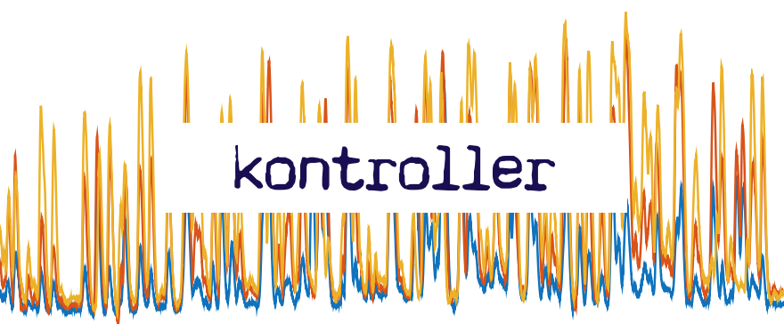
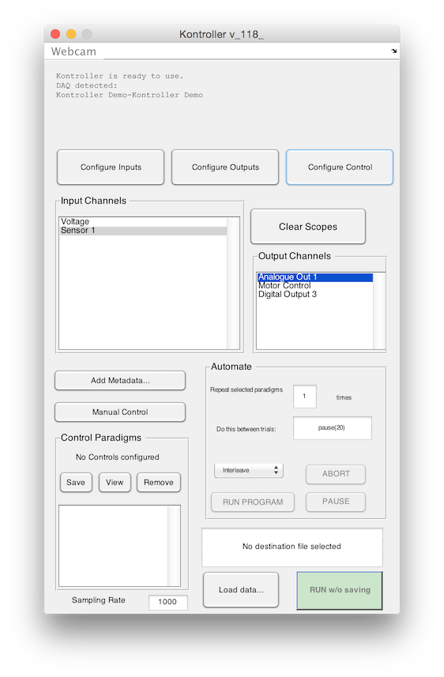
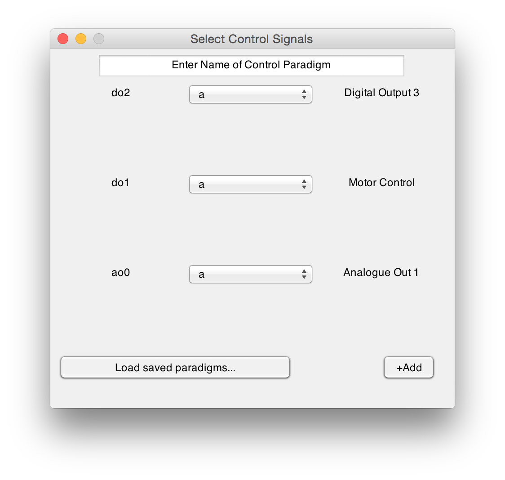

# kontroller



[](http://opensource.org/licenses/GPL-2.0) [](http://dx.doi.org/10.5281/zenodo.14584)

**a free wrapper for MATLAB DAQ to make experiments easier**

Kontroller is a free wrapper for MATLAB's DAQ toolbox that makes it very easy to begin doing experiments. Spend less time writing code and more time doing real science. 

## Features




### Click-and-Type Setup

Name a physical channel on your NI board to record from it or write to it. Delete the name to stop using it. It's that simple.

### Oscilloscope

Don't want to record data but just see what your data stream looks like? A handy scope function looks at live data without recording anything.



### Analogue/digital inputs, and analogue outputs. Simultaneously.

Record continuous analogue data while writing predefined vectors to analogue or digital outputs at the same time. Control LEDs while measuring from light sensors. Turn stepper motors while measuring from a strain gauge. No matter what your task, it's the same config.

### Automation 

`kontroller` can be easily automated by creating `Control Paradigms` that specify sequences of reads and writes to your devices. `Control Paradimgs` can be run one after the other, with arbitrary inter-trial functions. 

### Programmable 

`kontroller` is fully programmable, and can be used as a command line tool for more complex tasks. 

## Installation

The recommended way to install `kontroller` is to use my package manager:

```matlab
>> urlwrite('http://srinivas.gs/install.m','install.m'); 
>> install kontroller
>> install srinivas.gs_mtools
```
if you have [git](http://www.git-scm.com/) installed, you can 

```bash
git clone https://github.com/sg-s/kontroller
git clone https://github.com/sg-s/srinivas.gs_mtools # kontroller needs this to work
```
and don't forget to add these folders to your `MATLAB path`

